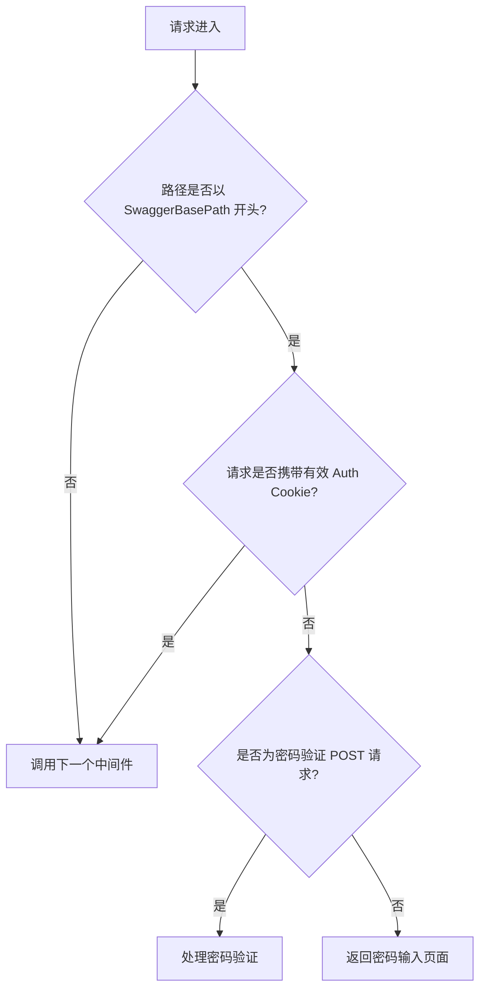

# 密码保护流程 — 内部实现说明

本文档详细解释了 `Lzq.Extensions.NSwag` 中 Swagger UI 密码保护的实现原理、中间件管道、Cookie 验证以及安全注意事项。

## 1. 触发条件

当 `EnableSwaggerUIPassword` 被设置为 `true` 时，`UseLzqNSwag` 方法会在 Swagger UI 中间件之前插入一个自定义密码验证中间件。该中间件会检查所有以 `SwaggerBasePath`（默认 `/swagger`）开头的请求。

## 2. 中间件处理流程

### 步骤描述

1. **路径过滤**：中间件只处理路径以 `SwaggerBasePath` 开头的请求，其他请求直接放行。
2. **Cookie 检查**：检查请求是否携带名为 `SwaggerUIPasswordCookieName`（默认 `SwaggerUIAuth`）的 Cookie，并将其值与存储的密码哈希比对。如果匹配，直接放行。
3. **密码验证 POST**：如果路径匹配 `SwaggerPasswordVerifyPath`（默认 `/swagger-password-verify`）且请求方法为 `POST`，则读取表单中的 `password` 字段进行验证。
4. **返回密码页面**：对于其他未经授权的请求，返回一个包含密码输入表单的 HTML 页面。

## 3. 密码验证逻辑

当用户提交密码时：

- 从表单中提取 `password` 字段。
- 与配置中的 `SwaggerUIPassword` 明文比较。
- **验证成功**：

  - 使用 SHA256 对密码进行哈希。
  - 将哈希值存入 Cookie（`HttpOnly`、`Secure`、`SameSite=Strict`）。
  - Cookie 过期时间按 `SwaggerUIPasswordCookieExpirationMinutes` 设定（默认 8 小时）。
  - 返回 JSON `{"success": true}`。
- **验证失败**：

  - 返回 JSON `{"success": false, "message": "密码错误，无法访问 Swagger UI"}`（可通过 `SwaggerUIPasswordErrorMessage` 自定义消息）。
  - 前端显示错误提示。

## 4. Cookie 验证机制

- Cookie 名称：`SwaggerUIPasswordCookieName`（默认 `"SwaggerUIAuth"`）
- Cookie 值：`SHA256(明文密码)` 的 Base64 字符串。
- Cookie 属性：

  - `HttpOnly = true`：防止客户端脚本读取。
  - `Secure = true`（仅 HTTPS 环境）。
  - `SameSite = Strict`：防止 CSRF。
  - `Expires`：当前时间 + `SwaggerUIPasswordCookieExpirationMinutes`。
- 后续请求携带该 Cookie 后，中间件重新计算哈希并与 Cookie 值比对，一致则放行。

## 5. 自定义配置

所有相关配置项均可在注册服务时通过 `NSwagOptions` 调整：

| 配置项 | 说明                         |
| -------- | ------------------------------ |
| `SwaggerBasePath`       | 受保护的路径前缀，默认 `/swagger`      |
| `SwaggerPasswordVerifyPath`       | 密码验证接口路径，默认 `/swagger-password-verify`      |
| `SwaggerUIPasswordCookieName`       | Cookie 名称，默认 `"SwaggerUIAuth"`           |
| `SwaggerUIPasswordCookieExpirationMinutes`       | Cookie 有效期（分钟），默认 `480` |
| `SwaggerUIPasswordErrorMessage`       | 密码错误时的提示信息         |

## 6. 安全性考量

- **哈希存储**：Cookie 中存储的是密码的 SHA256 哈希，而非明文密码。即使 Cookie 泄露，攻击者也无法直接获取原始密码。
- **传输安全**：强烈建议在生产环境使用 HTTPS，确保 Cookie 的 `Secure` 标记生效，防止中间人攻击。
- **密码强度**：`SwaggerUIPassword` 应设置为高强度随机字符串，并通过环境变量或机密管理器注入，避免硬编码在源码中。
- **防暴力破解**：当前版本未内置请求频率限制，建议在反向代理（如 Nginx）或网关层配置速率限制，防止暴力尝试。
- **日志记录**：中间件会记录非授权访问的警告日志，便于安全审计。

## 7. 与正式身份认证的区别

此密码保护仅作为**轻量级 UI 访问控制**，适用于内部开发/测试环境，不适用于生产环境的细粒度权限管理。对于需要与现有身份系统集成的场景，建议使用 JWT、OAuth2 等标准认证方案，NSwag 已通过 `EnableJwtSecurity` 提供了原生的 JWT 支持。